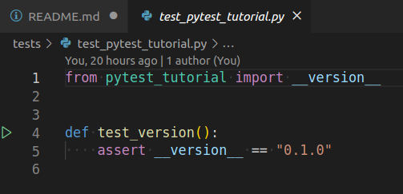

# Pytest Tutorial

This repo contains instructions and example code for use in teaching the Pytest testing framework to Clinical Bioinformaticians.

## Setup

This tutorial assumes that you have the following installed:
- VS Code with the Python extension for Visual Studio Code installed. 

First download the github repo [pytest_tutorial](https://github.com/Graeme-Smith/pytest_tutorial) 

```bash
git clone git@github.com:Graeme-Smith/pytest_tutorial.git
```

Open the folder `pytest_tutorial`, you've created, in VS code `ctrl + o`.  Open a new terminal in VS code `ctrl + shift + \``   

The repo has all its virtual environment and python dependencies managed by poetry.  Install poetry if you do not already have it installed:

```bash
curl -SSL https://raw.githubusercontent.com/sdispater/poetry/master/get-poetry.py | python
```
To configure your current shell run:

```bash
source $HOME/.poetry/env
# Install dependencies
poetry install
```

## Setup Poetry in VS Code 

Open the file pytest_tutorial.py.  In the bottom right hand corner VS Code will display the current Python Environment.


Click it and a list of available Environments will display. Choose the one that has the name of your project, pytest_tutorial, in it:


## Integrate pytest with VS Code

Open the `tests` folder and open `test_pytest_tutorial.py` 

This test imports the \__version__ variable from the \__init__.py file that is inside the pytest_tutorial folder and asserts that the current version is 0.1.0.



In the integrated terminal run pytest from the commandline:

```bash
pytest
```

We will want to integrate pytest with VS code. Open your Command Palette with `shift + ctrl + p`:

- Type unit in the search box and select Python: Configure Unit Tests.
- Select pytest.
- Choose the directory in which the tests are stored, tests in our case.

A new Testing icon resembling a conical flask appears at the left bar. If you click on it a panel displaying all the tests will appear. Here, you can run each one individually, or all the tests simultaneously.

## Examining a failing test

In `test_pytest_tutorial.py` change the version in the assert to 0.1.1,save the change, and run pytest again.

Revert the version checked back to 0.1.0 and ensure that the test now passes.

## Calculating test coverage using coverage.py

```bash
poetry run coverage run -m pytest && poetry run coverage report -m
```

## License
[MIT](https://choosealicense.com/licenses/mit/)